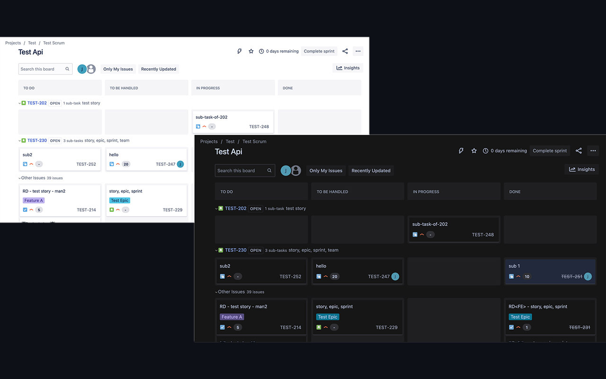
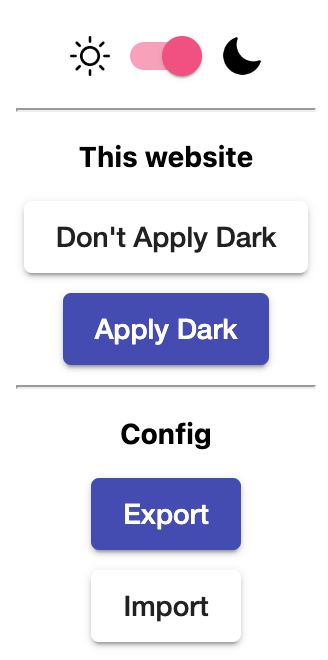

# Dark

This is a Chrome extension that allows all websites to be converted to a dark theme.



## Introduction

Provide a master switch that can turn off Dark and restore all web pages to normal when needed.

If a website is not suitable for a dark theme, you can click the "Don't Apply Dark" button in extension popup menu and it will be recorded in preference settings.

You can also click the "Export" button in extension popup menu to export preference settings for backup and click "Import" to restore settings from backup file.



## How to develop

Switch to project root directory and enter following commands in console:

```bash
npm install
npm run watch
```

After the library is installed and built, go to Chrome extension settings page and click `Load unpacked` in top left corner. In dialog box, select `dist` folder in project root directory.

## How to compile for production

In project root directory, run following command:

```bash
npm run build
```

The compiled result for production environment can be found in `dist` folder.

## How to package into a crx file

In project root directory, create a `crx` folder and put the `dist.pem` key that is needed for packaging into it.

Run the following commands:

```bash
npm run build
npm run crx
```

The `dist.crx` file can be found in `crx` folder.
